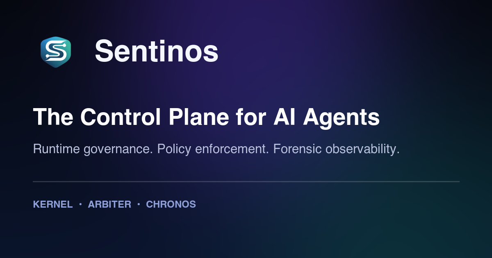

# `sentinos` (Python SDK)

[](https://pypi.org/project/sentinos/)
[](https://pypi.org/project/sentinos/)
[](https://github.com/SentinosHQ/sentinos-python/actions/workflows/ci.yml)
[](LICENSE)

<p>
  
</p>



Sentinos is the control plane for AI agents: runtime governance, deterministic policy outcomes, and trace-backed forensics.

This package is the ergonomic Python wrapper over `sentinos-sdk-core`, exposing operator-first clients for:

- Kernel (execution boundary, autonomy sessions, escalations, traces)
- Arbiter (policy lifecycle + deterministic outcomes)
- Chronos (context snapshots and provenance)
- Alerts, incidents, marketplace, and supporting workflows

## Install

```bash
pip install sentinos
```

Optional extras:

```bash
pip install "sentinos[providers]"  # openai + anthropic + boto3 (bedrock)
pip install "sentinos[otel]"       # OpenTelemetry helpers
pip install "sentinos[langchain]"  # LangChain integration helpers
pip install "sentinos[grpc]"       # grpcio + protobuf (native gRPC protocol smoke/integration)
```

## Configure

The SDK supports a “single URL” setup by default:

```bash
export SENTINOS_BASE_URL="https://api.sentinos.ai"
export SENTINOS_ORG_ID="<org-id>"
export SENTINOS_ACCESS_TOKEN="<access-token>"
```

Notes:

- `SENTINOS_ORG_ID` is preferred; `SENTINOS_TENANT_ID` remains supported as an alias.
- If you run services on separate hosts, set `SENTINOS_KERNEL_URL`, `SENTINOS_ARBITER_URL`, `SENTINOS_CHRONOS_URL`.

## Quickstart

Environment-driven:

```python
from sentinos import SentinosClient

client = SentinosClient.from_env()
print(client.kernel.get_runtime_metrics())
print(client.arbiter.governance_dashboard())
```

Explicit constructor (use `org_id`; `tenant_id` is an alias):

```python
from sentinos import SentinosClient
from sentinos.auth.jwt import JWTAuth

client = SentinosClient.simple(
    base_url="https://api.sentinos.ai",
    org_id="acme",
    auth=JWTAuth(lambda: "<access-token>"),
)
print(client.kernel.get_runtime_metrics())
```

## Local Development

Standalone SDK repo:

```bash
python3 -m venv .venv && source .venv/bin/activate
python -m pip install --upgrade pip
pip install -e .[dev]
tox -q
```

Monorepo development (when `../sdk-core/python` exists):

```bash
python3 -m venv .venv && source .venv/bin/activate
python -m pip install --upgrade pip
pip install -e ../sdk-core/python
pip install -e .[dev]
tox -q
```

## Workforce Auth (Enterprise)

Enterprise workforce token exchange auth:

```python
from sentinos import SentinosClient, WorkforceAssertion, WorkforceTokenProvider
from sentinos.auth.jwt import JWTAuth

workforce_provider = WorkforceTokenProvider.from_env(
    assertion_provider=lambda: WorkforceAssertion(
        external_subject="employee-123",
        email="employee@enterprise.example",
        groups=["AI_USERS"],
    ),
    idp_issuer="https://login.microsoftonline.com/tenant/v2.0",
)

client = SentinosClient(
    org_id="enterprise-org",
    base_url="https://api.sentinos.ai",
    auth=JWTAuth(workforce_provider),
)
```

Workforce token CLI bootstrap (helpful for enterprise workstation rollout and diagnostics):

```bash
sentinos-workforce-auth exchange \
  --controlplane-url "https://app.sentinoshq.com" \
  --org-id "<org-id>" \
  --idp-issuer "https://login.microsoftonline.com/<tenant>/v2.0" \
  --external-subject "<employee-sub>" \
  --assertion-token "<signed-idp-jwt>" \
  --audience "sentinos-workforce"
```

## LLM / Agent Runtime Integration

Use `LLMGuard` when your application executes provider calls directly (OpenAI, Anthropic, LangChain tools, custom APIs)
and you still want Sentinos policy decisions + decision traces for every interaction.

```python
from sentinos import LLMGuard, SentinosClient

client = SentinosClient.from_env(org_id="acme")
guard = LLMGuard(kernel=client.kernel, agent_id="assistant-1", session_id="sess-123")

result = guard.run(
    provider="openai",
    operation="chat.completions",
    model="gpt-4o-mini",
    request={"messages": [{"role": "user", "content": "Summarize this incident"}]},
    invoke=lambda: {"id": "resp-1", "model": "gpt-4o-mini"},
)
print(result.trace.trace_id, result.trace.decision)
```

For Open Responses-compatible providers/endpoints:

```python
from sentinos import LLMGuard, SentinosClient, create_openresponses_adapter

client = SentinosClient.from_env(org_id="acme")
guard = LLMGuard(kernel=client.kernel, agent_id="assistant-1", session_id="sess-openresponses-1")
adapter = create_openresponses_adapter(guard=guard, client=openai_client)
result = adapter.create(
    model="gpt-4.1-mini",
    input=[{"type": "message", "role": "user", "content": "summarize recent incidents"}],
)
print(result.trace.trace_id, result.trace.decision, result.response.status)
```

Drop-in adapter classes are also available when you already have provider client objects:

```python
from sentinos import LLMGuard, OpenAIChatCompletionsAdapter, SentinosClient

client = SentinosClient.from_env(org_id="acme")
guard = LLMGuard(kernel=client.kernel, agent_id="assistant-1", session_id="sess-123")
adapter = OpenAIChatCompletionsAdapter.from_client(guard=guard, client=openai_client)
result = adapter.create(model="gpt-4o-mini", messages=[{"role": "user", "content": "hello"}])
print(result.trace.trace_id, result.trace.decision)
```

Optional extras:

```bash
pip install "sentinos[providers]"   # openai + anthropic + boto3 (bedrock)
pip install "sentinos[bedrock]"     # boto3 only
pip install "sentinos[grpc]"        # grpcio + protobuf (native gRPC protocol smoke/integration)
pip install "sentinos[langchain]"   # langchain runtime integrations
```

Native Kernel gRPC protocol smoke example (non-Go interoperability):

```bash
export SENTINOS_GRPC_TARGET="localhost:9091"
export SENTINOS_ACCESS_TOKEN="<jwt-access-token>"
export SENTINOS_ORG_ID="<org-id>"
python examples/protocols/grpc_execute_smoke.py
```

Live end-to-end OpenAI governance suite (real traffic + alerts/incidents/traces/evidence):

```bash
export SENTINOS_E2E_AUTH_MODE=token
export SENTINOS_ORG_ID="<org-id>"
export SENTINOS_ACCESS_TOKEN="<jwt-access-token>"
export OPENAI_API_KEY="<openai-key>"
python examples/live_e2e/run_full_live_e2e.py
```

Suite details:

- `examples/live_e2e/README.md`
- `examples/live_e2e/stage_00_bootstrap_account.py`
- `examples/live_e2e/stage_01_setup.py`
- `examples/live_e2e/stage_02_openai_traffic.py`
- `examples/live_e2e/stage_03_triage.py`
- `examples/live_e2e/stage_04_verify.py`

Factory helpers for low-friction org onboarding:

```python
from sentinos import LLMGuard, SentinosClient, create_openai_chat_adapter

client = SentinosClient.from_env(org_id="acme")
guard = LLMGuard(kernel=client.kernel, agent_id="assistant-1", session_id="sess-123")
adapter = create_openai_chat_adapter(guard=guard, client=openai_client)
result = adapter.create(model="gpt-4o-mini", messages=[{"role": "user", "content": "hello"}])
print(result.trace.trace_id, result.trace.decision)
```

Helper for OpenAI-style `chat.completions.create` signatures:

```python
from sentinos import LLMGuard, SentinosClient, guard_openai_chat_completion

client = SentinosClient.from_env(org_id="acme")
guard = LLMGuard(kernel=client.kernel, agent_id="assistant-1", session_id="sess-123")

def fake_create(*, model, messages, temperature=0.2):
    return {"id": "chat-1", "model": model, "messages": messages}

result = guard_openai_chat_completion(
    guard=guard,
    create=fake_create,
    model="gpt-4o-mini",
    messages=[{"role": "user", "content": "hello"}],
)
print(result.response["id"])
```

OpenRouter factories (provider identity: `openrouter`):

```python
from sentinos import LLMGuard, SentinosClient, create_openrouter_chat_adapter

client = SentinosClient.from_env(org_id="acme")
guard = LLMGuard(kernel=client.kernel, agent_id="assistant-1", session_id="sess-openrouter-1")
adapter = create_openrouter_chat_adapter(
    guard=guard,
    api_key="<OPENROUTER_API_KEY>",
    http_referer="https://console.example.com",
    x_title="Sentinos Console",
)
result = adapter.create(model="openai/gpt-4.1-mini", messages=[{"role": "user", "content": "hello"}])
print(result.trace.trace_id, result.trace.decision)
```

Amazon Bedrock native Converse adapters (provider identity: `bedrock`):

```python
from sentinos import LLMGuard, SentinosClient, create_bedrock_converse_adapter

client = SentinosClient.from_env(org_id="acme")
guard = LLMGuard(kernel=client.kernel, agent_id="assistant-1", session_id="sess-bedrock-1")
adapter = create_bedrock_converse_adapter(guard=guard, region_name="us-east-1")
result = adapter.converse(
    model_id="anthropic.claude-3-5-sonnet-20240620-v1:0",
    messages=[{"role": "user", "content": [{"text": "summarize incidents"}]}],
)
print(result.trace.trace_id, result.trace.decision)
```

## Quality Gates

Local package checks:

```bash
tox -q
```

Monorepo-only checks (if you have the full Sentinos repo):

```bash
scripts/quality/check_python_sdk_quality.sh
scripts/quality/check_sdk_docs_examples.sh
scripts/quality/check_sdk_parity_matrix.py
```

## Reference

- Docs: https://docs.sentinoshq.com/sdk/
- Release runbook (monorepo): `docs/sentinos-python-sdk-release-runbook.md`
- Release guide (package-local): `RELEASING.md`

## Trace Forensics and Retention Example

```python
from sentinos import SentinosClient

client = SentinosClient.from_env(org_id="acme")
trace_id = "11111111-1111-1111-1111-111111111111"

ledger = client.traces.ledger_verify(trace_id)
replay = client.traces.replay_trace(trace_id, request={"include_explain": True})
retention = client.traces.get_retention_policy()
dry_run = client.traces.enforce_retention(request={"dry_run": True})
distributed = client.traces.distributed_trace_summaries(limit=25)

print(ledger.verified, replay.drift_detected, retention.trace_days, dry_run.traces_affected, len(distributed))
```
